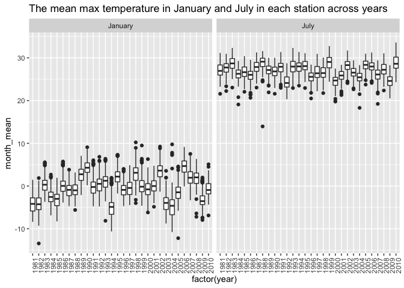
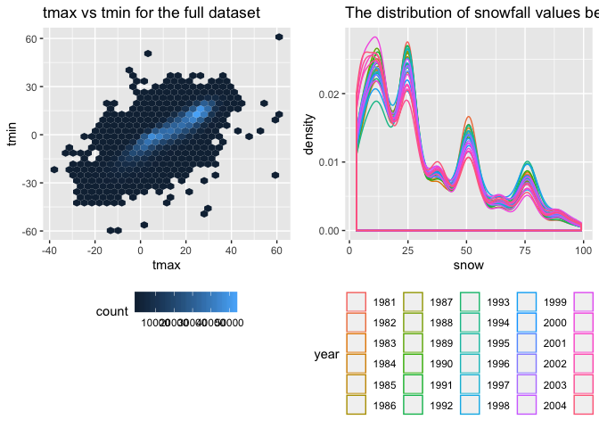

p8105\_hw3\_dz2399
================
DZ
October 4, 2018

Problem 1
---------

#### First, do some data cleaning:

-   format the data to use appropriate variable names;
-   focus on the “Overall Health” topic
-   include only responses from “Excellent” to “Poor” (i.e. no pre-collapsed categories)
-   organize responses as a factor taking levels from “Excellent” to “Poor”

``` r
data("brfss_smart2010")
df_brfss <- brfss_smart2010 %>% 
  janitor::clean_names() %>% 
  filter(topic== 'Overall Health') %>%
  select(-c(class,topic,question,sample_size,confidence_limit_low:geo_location)) %>% 
  mutate(response= as.factor(response))
df_brfss$response <-
  factor(df_brfss$response,levels(df_brfss$response)[c(4,2,3,5,1)])
rm(brfss_smart2010)
```

#### In 2002, which states were observed at 7 locations?

``` r
df_brfss %>% 
  filter(year==2002) %>% 
  spread(key=response, value=data_value) %>% 
  group_by(locationabbr) %>% 
  mutate(locations = length(unique(locationdesc))) %>% 
  filter(locations == 7 ) %>% 
  distinct(locationabbr) %>% 
  knitr::kable()
```

| locationabbr |
|:-------------|
| CT           |
| FL           |
| NC           |

In 2002, Connecticut, Florida and North Carolina were observed at 7 locations.

#### Make a “spaghetti plot” that shows the number of observations in each state from 2002 to 2010.

``` r
df_brfss %>% 
  group_by(locationabbr,year) %>% 
  summarise(n_obs = length(data_value)) %>% 
  ggplot(aes(x=year, y=n_obs, color = locationabbr))+
  geom_line()+
  ggtitle('the number of observations in each state from 2002 to 2010')+
  theme(legend.position = "right")
```


The spaghetti plot shows that every state has similar number of observations, except for florida which has the exceptional number of observations in 2007 and 2010 .

#### Make a table showing, for the years 2002, 2006, and 2010, the mean and standard deviation of the proportion of “Excellent” responses across locations in NY State.

``` r
df_brfss %>% 
  spread(key=response, value=data_value) %>% 
  janitor::clean_names() %>% 
  filter(year==2002|year==2006|year==2010, locationabbr=='NY') %>% 
  group_by(year) %>% 
  summarise(mean=mean(excellent),
            sd=sd(excellent)) %>% 
  knitr::kable(digits = 1)
```

|  year|  mean|   sd|
|-----:|-----:|----:|
|  2002|  24.0|  4.5|
|  2006|  22.5|  4.0|
|  2010|  22.7|  3.6|

In 2002, the mean for "Excellent" response in across the New York state is 24 with the standard deviation of 4.5. In 2006, this mean is 22.5 with the standard deviation of 4.0. IN 2010, this mean is 22.7 with the standard deviation of 3.6.

#### Make a five-panel plot that shows, for each response category separately, the distribution of these state-level averages over time.

``` r
df_brfss %>% 
  group_by(year, locationabbr, response) %>% 
  summarise(state_mean=mean(data_value)) %>% 
  ggplot(aes(x=year,y=state_mean))+
  geom_point()+
  facet_grid(.~response)
```

    ## Warning: Removed 21 rows containing missing values (geom_point).


-   The distribution of state-level average over time seems to be similar over the years, and the mean difference between each response group holds throughout the years.

Problem 2
---------

#### The goal is to do some exploration of this dataset. To that end, write a short description of the dataset, noting the size and structure of the data, describing some key variables, and giving illstrative examples of observations.

``` r
data("instacart")
instacart <- instacart %>% 
  janitor::clean_names()
```

The dataset has the dimension of 1384617, 15. Except for the regular id variables, add\_to\_cart\_order is a numeric variable that describe the order of that item when putting in shopping cart. order\_dow is a numeric variable that describes a day in a week when placing the order. aisle is character variable of that name of the asile. product\_name is a character variable describing the name of the product.

#### How many aisles are there, and which aisles are the most items ordered from?

``` r
instacart %>% 
  distinct(aisle_id) %>% 
  nrow()
```

    ## [1] 134

``` r
instacart %>% 
  group_by(aisle) %>% 
  summarise(number_of_items = n()) %>% 
  arrange(desc(number_of_items)) %>% 
  slice(1)
```

    ## # A tibble: 1 x 2
    ##   aisle            number_of_items
    ##   <chr>                      <int>
    ## 1 fresh vegetables          150609

-   There are 134 distinct rows, and the fresh vegetables aisle has the most items ordered, 150609 items.

#### Make a plot that shows the number of items ordered in each aisle. Order aisles sensibly, and organize your plot so others can read it.

``` r
aisle_plot <- instacart %>% 
  group_by(aisle_id) %>% 
  summarise(number_of_items = n()) %>% 
  arrange(desc(number_of_items))
aisle_plot$aisle_id_group <- as.numeric(cut(aisle_plot$aisle_id,4))
  ggplot(aisle_plot,aes(x=factor(aisle_id),y=number_of_items))+
  geom_point() + 
  xlab("Aisle_ID") +
  facet_wrap(~aisle_id_group, ncol = 1, scales = "free_x")+
  ggtitle('The number of items ordered in each aisle.')
```


The most popular items' product id are 24, 83, 123.

#### Make a table showing the most popular item aisles “baking ingredients”, “dog food care”, and “packaged vegetables fruits”

``` r
popular.items <- instacart %>% 
  filter(aisle=='baking ingredients'|aisle== 'dog food care'|aisle== 'packaged vegetables fruits') %>% 
  group_by(aisle,product_name) %>% 
  summarise(num_of_purchase = n()) %>% 
  group_by(aisle) %>% 
  filter(num_of_purchase == max(num_of_purchase)) 

  knitr::kable(popular.items)
```

| aisle                      | product\_name                                 |  num\_of\_purchase|
|:---------------------------|:----------------------------------------------|------------------:|
| baking ingredients         | Light Brown Sugar                             |                499|
| dog food care              | Snack Sticks Chicken & Rice Recipe Dog Treats |                 30|
| packaged vegetables fruits | Organic Baby Spinach                          |               9784|

The most popular items in baking ingredients is light brown sugar, purchased 499 times. The most popular items in dog food care is Snack Sticks chicken and Rice recipe Dog Treats, purchased 30 times. The most popular item in packaged vagetables fruits is Organic Baby Spinich, purchased 9784 times.

#### Make a table showing the mean hour of the day at which Pink Lady Apples and Coffee Ice Cream are ordered on each day of the week; format this table for human readers (i.e. produce a 2 x 7 table)

``` r
 ins <- instacart %>% 
  filter(product_name=='Pink Lady Apples'
         |product_name=='Coffee Ice Cream') %>% 
  select(order_dow,order_hour_of_day,product_name) %>% 
  group_by(product_name, order_dow) %>% 
  summarize(mean_time= mean(order_hour_of_day)) %>% 
  spread(key=product_name, value=mean_time) %>% 
  t() %>% 
  as.data.frame()
colnames(ins) <- c('Sunday','Monday','Tuesday','Wednesday','Thursday','Friday','Saturday')
knitr::kable(ins[-1,])
```

|                  |    Sunday|    Monday|   Tuesday|  Wednesday|  Thursday|    Friday|  Saturday|
|------------------|---------:|---------:|---------:|----------:|---------:|---------:|---------:|
| Coffee Ice Cream |  13.77419|  14.31579|  15.38095|   15.31818|  15.21739|  12.26316|  13.83333|
| Pink Lady Apples |  13.44118|  11.36000|  11.70213|   14.25000|  11.55172|  12.78431|  11.93750|

This table shows that the mean hour of people purchasing coffee ice cream and pink lady apples for each day of the week range approximately from 12pm to 4 pm. Poeple tend to order these items in the afternoon.

Problem 3
---------

``` r
data("ny_noaa")
df_nynoaa <- ny_noaa %>% 
  separate(date,into = c("year","month","day")) %>% 
  janitor::clean_names() %>% 
  mutate(tmin=as.numeric(tmin)/10,
         tmax=as.numeric(tmax)/10) %>% 
  na.omit()
```

The resulting data dimension is 1222433, 9. Id is character variable of the station id. Year, month and day are character variable of the corresponding date. Prcp is the precipitation of tenth of mm. Tmin and T max after the transformation are numeric variable in Celcius. Snow is an integer variable of snowfall in mm. With the regard to NAs, there are lots of NAs in the dataset, I omit all rows that have at least one NA, and the resulting dimesion is still big in enough(greater than 1 million). However, one could also just remove the NAs for the columns they are only interested in to have more observations.

#### Do some data cleaning. Create separate variables for year, month, and day. Ensure observations for temperature, precipitation, and snowfall are given in reasonable units. For snowfall, what are the most commonly observed values? Why?

``` r
df_nynoaa %>% 
  group_by(snow) %>% 
  summarise(obs=n()) %>% 
  filter(obs==max(obs))
```

    ## # A tibble: 1 x 2
    ##    snow     obs
    ##   <int>   <int>
    ## 1     0 1112758

-   The most commonly observed value for snowfall is 0, since in New York it only snows for a couple of times in winter, other times the snowfall would be zero.

#### Make a two-panel plot showing the average temperature in January and in July in each station across years. Is there any observable / interpretable structure? Any outliers?

``` r
df_nynoaa %>% 
  filter(month=='01'|month=='07') %>%
  group_by(month,year,id) %>% 
  summarise(month_mean=mean(tmax)) %>%
  ggplot(aes(x=factor(year),y=month_mean))+
    geom_boxplot()+
    facet_grid(.~month)+
  ggtitle('The mean max temperature in January and July in each station across years')+
  theme(axis.text.x = element_text(angle = 90, hjust = 1))
```



This plot shows that across the years, both January and July have some oscillation and do not show a generally increaing or decreasing trend. And there are outliers since each station has different geographical characteristics.

#### Make a two-panel plot showing (i) tmax vs tmin for the full dataset (note that a scatterplot may not be the best option); and (ii) make a plot showing the distribution of snowfall values greater than 0 and less than 100 separately by year.

``` r
plot1 <- ggplot(data=df_nynoaa, aes(x=tmax,y=tmin))+
  geom_hex()+
  ggtitle('tmax vs tmin for the full dataset')+
  theme(legend.position = "bottom")

plot2 <- df_nynoaa %>%
  filter(snow>0,snow<100) %>%
  ggplot(aes(x=snow, color=year))+
  geom_density( alpha=0.3)+
  ggtitle('The distribution of snowfall values between 0 and 100 by year')+
  theme(legend.position = "bottom")
plot1+plot2
```



The hex plot shows that the high frequencies concentrate in the middle, which indicates that when the tmin is within 0-20 Celcius and tmax is within 0-25 celcius, we would have the most of observations. The snowfalll plot show that the density curves overlap a lot, which indicates that the snowfall from 1981 to 2004 does not change greatly over the years.
