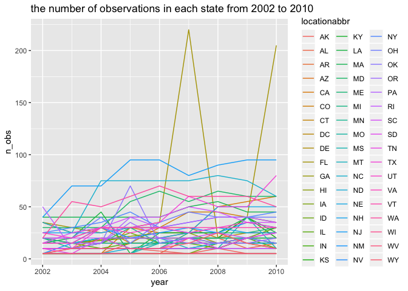

p8105\_hw3\_dz2399
================
DZ
October 4, 2018

Problem 1
---------

#### First, do some data cleaning:

-   format the data to use appropriate variable names;
-   focus on the “Overall Health” topic
-   include only responses from “Excellent” to “Poor” (i.e. no pre-collapsed categories)
-   organize responses as a factor taking levels from “Excellent” to “Poor”

``` r
data("brfss_smart2010")
df_brfss <- brfss_smart2010 %>% 
  janitor::clean_names() %>% 
  filter(topic== 'Overall Health') %>%
  select(-c(class,topic,question,sample_size,confidence_limit_low:geo_location)) %>% 
  mutate(response= as.factor(response))
df_brfss$response <-
  factor(df_brfss$response,levels(df_brfss$response)[c(4,2,3,5,1)])
rm(brfss_smart2010)
```

#### In 2002, which states were observed at 7 locations?

``` r
df_brfss %>% 
  filter(year==2002) %>% 
  spread(key=response, value=data_value) %>% 
  group_by(locationabbr) %>% 
  mutate(locations = length(unique(locationdesc))) %>% 
  filter(locations == 7 ) %>% 
  distinct(locationabbr)
```

    ## # A tibble: 3 x 1
    ## # Groups:   locationabbr [3]
    ##   locationabbr
    ##   <chr>       
    ## 1 CT          
    ## 2 FL          
    ## 3 NC

#### Make a “spaghetti plot” that shows the number of observations in each state from 2002 to 2010.

``` r
df_brfss %>% 
  group_by(locationabbr,year) %>% 
  summarise(n_obs = length(data_value)) %>% 
  filter(year==2002|year==2010) %>% 
  ggplot(aes(x=year, y=n_obs, color = locationabbr))+
  geom_line()
```



#### Make a table showing, for the years 2002, 2006, and 2010, the mean and standard deviation of the proportion of “Excellent” responses across locations in NY State.

``` r
df_brfss %>% 
  spread(key=response, value=data_value) %>% 
  janitor::clean_names() %>% 
  filter(year==2002|year==2006|year==2010, locationabbr=='NY') %>% 
  group_by(year) %>% 
  summarise(mean=mean(excellent),
            sd=sd(excellent)) %>% 
  knitr::kable(digits = 1)
```

|  year|  mean|   sd|
|-----:|-----:|----:|
|  2002|  24.0|  4.5|
|  2006|  22.5|  4.0|
|  2010|  22.7|  3.6|

#### For each year and state, compute the average proportion in each response category (taking the average across locations in a state). Make a five-panel plot that shows, for each response category separately, the distribution of these state-level averages over time.

``` r
df_brfss %>% 
  group_by(year, locationabbr, response) %>% 
  summarise(state_mean=mean(data_value)) %>% 
  ggplot(aes(x=year,y=state_mean))+
  geom_point()+
  facet_grid(.~response)
```

    ## Warning: Removed 21 rows containing missing values (geom_point).


Problem 2
---------

#### The goal is to do some exploration of this dataset. To that end, write a short description of the dataset, noting the size and structure of the data, describing some key variables, and giving illstrative examples of observations.
